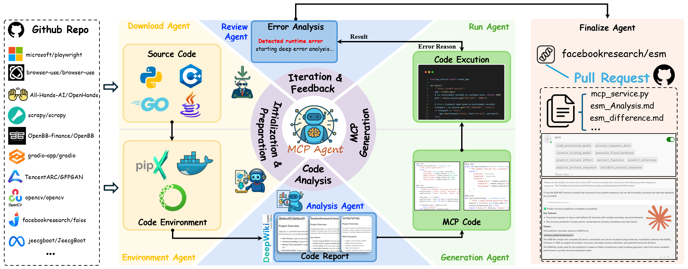
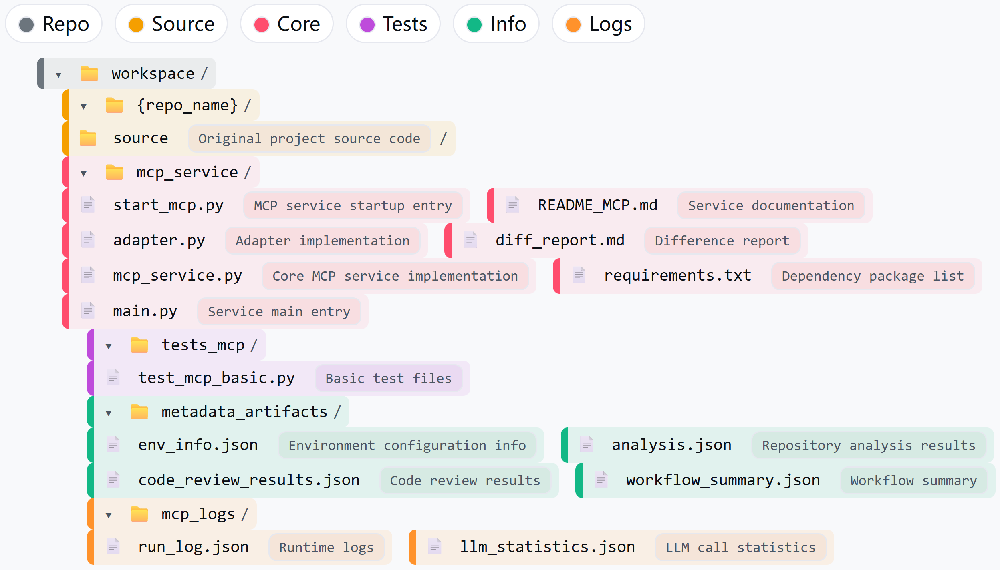

# Code2MCP

## Project Overview



Code2MCP is an automated workflow system that transforms existing code repositories into MCP (Model Context Protocol) services. The system follows a minimal intrusion principle, preserving the original repository's core code while only adding service-related files and tests.

## Core Features

1. **Intelligent Code Analysis**
   - LLM-powered deep code structure analysis
   - Automatic identification of core modules, functions, and classes
   - Smart generation of MCP service code

2. **MCP Service Generation**
   - Automatic generation of `mcp_service.py`, `adapter.py`, and other core files
   - Support for multiple project structures (src/, source/, root directory, etc.)
   - Intelligent handling of import paths and dependency relationships

3. **Workflow Automation**
   - Complete 7-node workflow: download → analysis → env → generate → run → review → finalize
   - Automatic environment configuration and test validation
   - Comprehensive logging and status tracking
   - Intelligent error recovery and retry mechanisms

## Quick Start

### 1. Environment Setup

Copy the environment variables template:
```bash
cp env_example.txt .env
```
Edit the `.env` file to configure necessary environment variables.

### 2. Install Dependencies

```bash
pip install -r requirements.txt
```

### 3. Run Workflow

```bash
# Basic usage
python main.py https://github.com/username/repo

# Specify output directory
python main.py https://github.com/username/repo --output ./my_output
```

## Workflow Process

1. **Download Node**: Clone repository to `workspace/{repo_name}/`
2. **Analysis Node**: LLM deep analysis of code structure and functionality
3. **Env Node**: Create isolated environment and validate original project
4. **Generate Node**: Intelligently generate MCP service code
5. **Run Node**: Execute service and perform functional validation
6. **Review Node**: Code quality review, error analysis, and automatic fixes
7. **Finalize Node**: Compile results and generate comprehensive report

## Output Structure

Complete structure for each converted project:



## Successfully Converted Project Examples

- **UFL**: Finite element symbolic language → MCP finite element analysis
- **dalle-mini**: Higher-quality, controllable text-to-image → MCP image generation
- **ESM**: Protein structure/variant scoring (real artifacts) → MCP protein analysis
- **deep-searcher**: Query rewrite, multi-hop, credible sources → MCP search
- **TextBlob**: Deterministic tokenize/POS/sentiment → MCP NLP preprocessing
- **dateutil**: Correct timezones/rrule edge cases → MCP time utilities
- **sympy**: Exact symbolic math/solve/codegen → MCP math reasoning

## Key Features

- **Smart Import Handling**: Automatic identification of correct module import paths
- **Professional Documentation**: Automatic generation of English README and comments
- **Comprehensive Test Coverage**: Includes basic functionality tests and health checks
- **Detailed Report Generation**: Provides complete conversion process reports
- **Intelligent Dependency Management**: Automatic handling of complex Python package dependencies

## Usage Example

```bash
python main.py https://github.com/username/repo
```

## Using Converted MCP Services with Your AI Agent

You can configure MCP services converted by Code2MCP for use in your AI agent (e.g., Cursor). Below are instructions and some examples to help you get started.

### Example Pre-Converted MCP Services

Here are a few examples you can use right away:

-   **ESM**: For advanced protein analysis and structure prediction.
    ```json
    "esm": {
      "url": "https://kabuda777-Code2MCP-esm.hf.space/mcp"
    }
    ```

-   **SymPy**: For powerful symbolic and numerical mathematics.
    ```json
    "sympy": {
      "url": "https://kabuda777-Code2MCP-sympy.hf.space/mcp"
    }
    ```

### How to Configure in Cursor

1.  **Open MCP Configuration File**: Navigate to your AI agent's configuration file. For Cursor, this is located at: `c:\Users\[Username]\.cursor\mcp.json`.

2.  **Add Your New Tool**: In the `mcpServers` object, copy and paste the configuration snippet for the tool you want to add from the list above.

3.  **Reload Configuration**: Restart Cursor or use its reload function to apply the changes. Your new MCP tool will now be available.

-----

## Citation

If you use Code2MCP in your research, please cite our paper:

```bibtex
@article{ouyang2025code2mcp,
  title={Code2MCP: Transforming Code Repositories into MCP Services},
  author={Ouyang, Chaoqian and Yue, Ling and Di, Shimin and Zheng, Libin and Yue, Linan and Pan, Shaowu and Yin, Jian and Zhang, Min-Ling},
  journal={arXiv preprint arXiv:2509.05941},
  year={2025}
}
```


